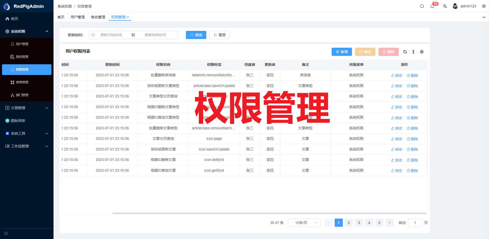
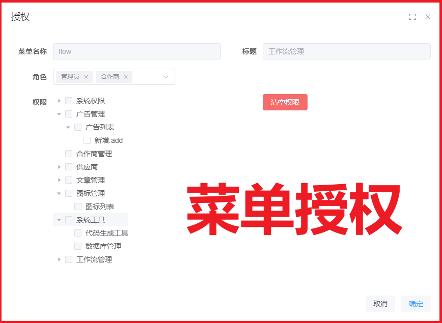

## 拒绝白嫖!!!
请右上角star，谢谢！！！

## 技术交流群

 

## 分支版本说明
v2.0为SpringBoot3.1.2+Shiro+Vue3版本\
v1.0为SpringBoot2.5.7+SpringSecurity5.x+Vue3版本\
master版本为SpringBoot3.1.2版本\
【如果点赞多,我会出sa-token、jpa...等各种版本,我什么都能写,哈哈哈哈】

### 有问题可以在issues中提哈

 

## 视频讲解

 
 

如果上面两个视频不能满足，那么你可以考虑下面这套开发视频哈： \
 

## 项目介绍
- RedPig 是一个轻量级的，前后端分离的Java快速开发平台，能快速开发项目并交付
- 系统架构：SpringBoot3、SpringSecurity6、MyBatis-Plus、Vue3、TypeScript、Vite、Pina框架
- 代码生成器：一键生成服务端、客户端代码以及数据库SQL文件，开发人员只需关注业务

## 内置功能
***权限为动态权限,非其他开源框架那种权限写死在Controller接口上!!!***
1.  用户管理：系统用户，用户具有角色、权限
2.  角色管理：用户可以分配多个角色，菜单可以分配多个角色，用户登录通过角色判断拥有的菜单
3.  权限管理：权限标识使用：1、前端按钮数据权限展示，2、后端SpringSecurity接口访问动态授权
4.  菜单管理：配置菜单角色、按钮数据权限标识
5.  菜单生成：代码生成器生成代码后，可以生成菜单，默认是管理员可以访问
6.  部门管理：配置用户所属部门
7.  代码生成：代码生成器可以一键生成服务端、VUE客户端、SQL语句
8.  工作流程：整合activiti7最新工作流架构：部署流程定义文件，发布流程，审批流程
9.  定时管理：定时器、定时器使用的job类管理，在线表达式生成

| 技术栈      		 | 版本 		  | 
| :---        		 | :----:   	  | 
| JDK      	  		 | 17          | 
| SpringBoot  		 | 3.1.2       | 
| Mybatis-Plus  	 | 3.5.3 	  | 
| SpringSecurity6.x  | 6.1.2 	  | 
| MySql  	  		 | 8.0         | 
| Lombok  	  		 | 1.8.22      | 
| junit-jupiter | 5.7.2       | 
| hutool-all    | 5.8.19      | 
| knife4j       | 4.0.0       | 
| Vue  	      	| 3.x         | 
| axios  	    | 1.4.0       |
| echarts  	    | 5.4.2       |
| element-plus  | 2.3.6       |
| js-cookie     | 3.0.5       |
| nprogress     | 0.2.0       |
| pinia         | 2.1.3       |
| vue-router    | 4.2.2       |
| Activiti      | 7.x         |
| Quartz        | 2.x         |

## 前端模板
- 用的是这个哥们写的哈
https://gitee.com/yiming_chang/vue-pure-admin

## 如何部署？
### 数据库
1、导入本项目下面的redpig.sql文件到数据库，数据库名称redpig即可 \
2、修改redpig-boot/application.yml 中的数据库账号密码\
### 服务端
1、启动APP即可
### 客户端
pnpm run dev
### 账号密码
admin123/admin123
## 功能展示
### 数据库表（后续还要新增表。。。。）

### 登录

### 系统首页

### 用户管理

### 用户授权

### 角色管理

### 权限管理

### 菜单管理

### 新增菜单

### 菜单授权

### 部门管理

### 代码生成器

#### 同步数据库字段

#### 生成代码

### 流程部署

### 请假流程

### 待办任务

### 定时器管理

### 定时器任务管理

### 启动定时器

