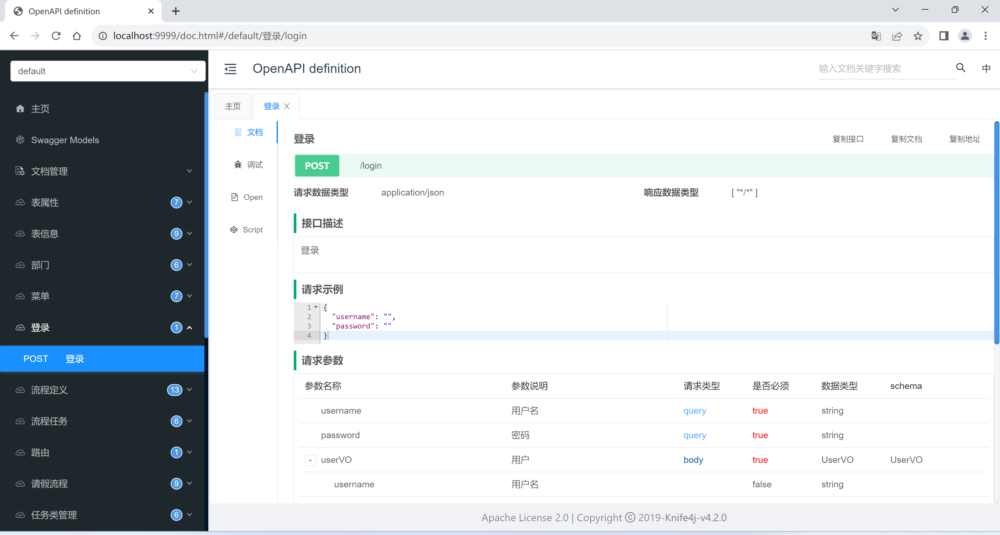
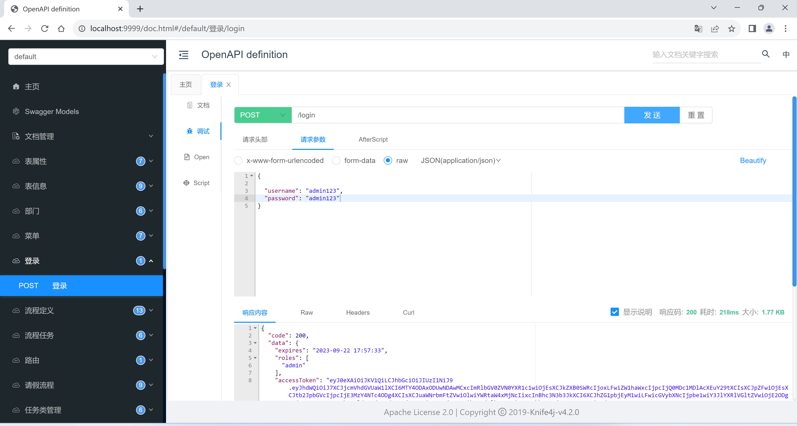
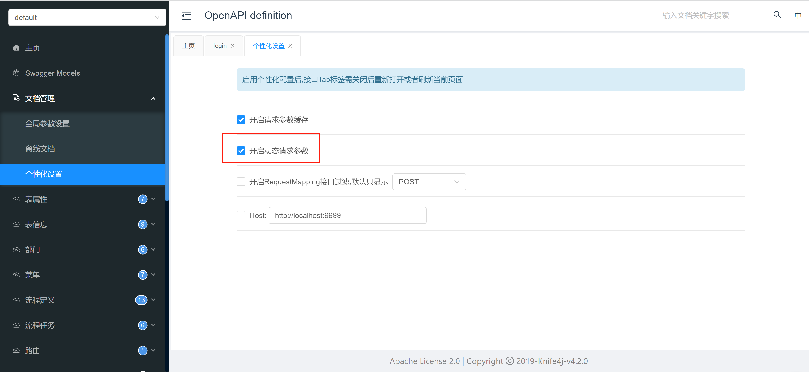
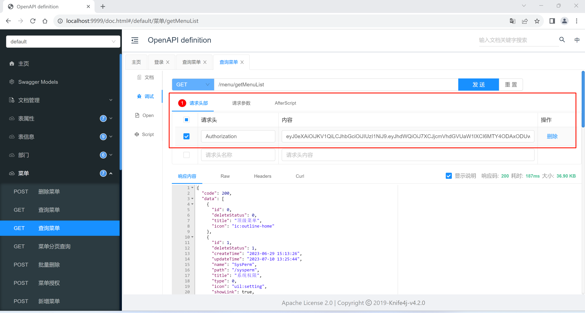

### 接口文档地址
http://localhost:9999/doc.html \
或者\
http://localhost:9999/swagger-ui/index.html

接口文档访问注意:请求头需要设置token,token需要登录才能获得

### 登录
登录获取token

#### 获得token
访问接口之前需要获得token

### 设置swagger文档请求头
swagger文档默认是不能添加请求头的，需要设置

### 测试查询：添加请求头
